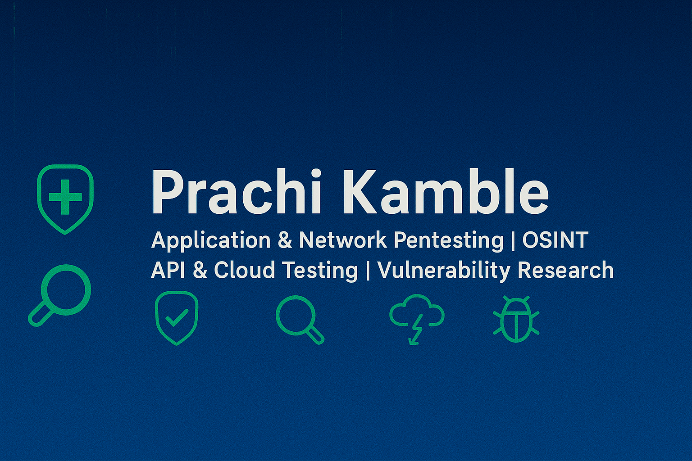

  

<h1 align="center">Hi 👋, I'm Prachi kamble</h1>
<h3 align="center">A passionate Cybersecurity Enthusiast from India</h3>

 

- 🔭 I have hands-on experience in **Vulnerability Assessment & Penetration Testing (VAPT) & (WAPT) through labs and real-world targets (VDP programs)**  

- 🌱 I’m currently practicing ** advanced(WAPT:API & AI Testing) Cloud Security, Digital Forensics **
  
- 🔎 I also explore **OSINT investigations (security auditing techniques) & SOC & SIEM tools (Wazuh, Zabbix, Grafana) for log monitoring, analysis, and incident detection)**.
    
- 📫 How to reach me **prachikamble2345@gmail.com**

- ⚡ Fun fact **I love identifying security flaws and reporting them responsibly to make systems safer 🙂🧐**

<h3 align="left">Connect with me:</h3>

<h3 align="left">Skills and Tools:</h3>

               

<h3 align="left">📊 GitHub Stats:</h3>

  
  

